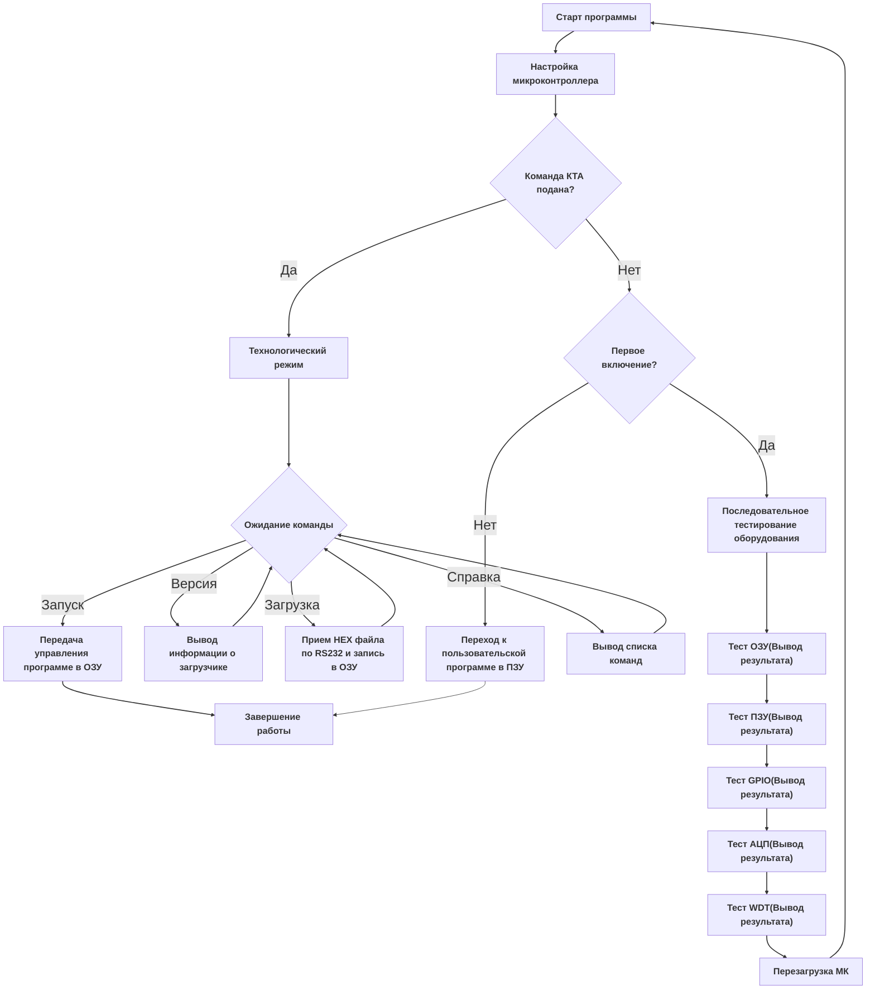

# Stm-loader

Рабочий проект загрузчика микроконтроллера STM32f407. Предназначен для настройки микроконтроллера, проверки работоспособности периферии и загрузки hex-файлов в ОЗУ.

## Блок схема

 

### Режимы работы
Загрузчик имеет два режима работы. Технологически и основной. В технологическом режиме загрузчик принимает команды по UART, с помощью которых он может загружать hex-файлы в ОЗУ и передават им управление. В основном режиме загрузчик осуществляет настройку самого микроконтроллера и проверяет работу периферии. После всех проверок управление передается пользовательской(бортовой) программе.

## Используемые инструменты

- OC: Windows
- компилятор: arm compiller 5
- стандарт языка: С99
- отладчик: интегрированный в Keil µVision 5
- терминальная программа: Putty или Tera Term
